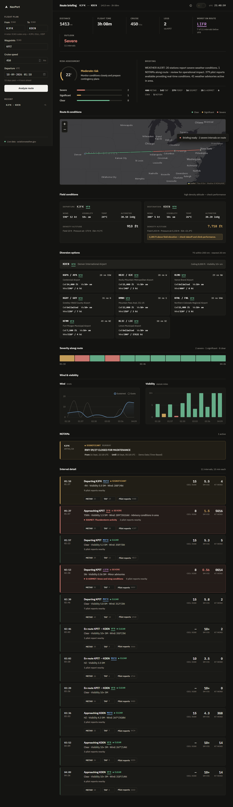
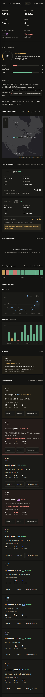

# NavPort

A flight weather dashboard for pilots and aviation planners. Enter a route,
and NavPort pulls live METARs, TAFs, PIREPs, SIGMETs, G-AIRMETs and CWAs
along the flight path, builds a 15-minute interval timeline, and produces a
plain-English briefing with an automated risk assessment.

## How to Run

There are two ways. **Python** is for developing on your laptop.
**Docker** is the shape that gets hosted on Azure — same image, same port,
same memory cap. The assignment path is Docker, then
[docs/DEPLOYMENT.md](docs/DEPLOYMENT.md).

### Local development (Python)

| Platform | Double-click |
|---|---|
| Windows | **[`run.bat`](run.bat)** |
| macOS / Linux | **[`run.command`](run.command)** |

Either one will:

1. Check that Python 3.9+ is installed (and tell you where to get it if not).
2. Create a virtual environment in `.venv/` — skipped if one already exists.
3. Install dependencies from `requirements.txt` — skipped if they're already
   up to date.
4. Start the Flask dev server on `http://localhost:5000` (debugger and LAN
   bind are opted into explicitly; production defaults stay safe).

Re-running is always safe after a `git pull`. On macOS, if double-clicking
opens a text editor, run `chmod +x run.command` once, or `./run.command`.

Manual equivalent:

```bash
python -m venv .venv
# Windows: .venv\Scripts\activate
# macOS / Linux: source .venv/bin/activate
pip install -r requirements.txt
python run.py
```

### What you deploy (Docker)

This is the production image Azure will run. Install
[Docker Desktop](https://www.docker.com/products/docker-desktop/), then from
this folder:

```bash
docker compose up --build
```

Open **http://localhost:8000** and **http://localhost:8000/api/health**.
`"status":"ok"` means gunicorn started and the airport database loaded.

Compose uses 0.5 CPU / 1 GB — the same size as a free Azure Container Apps
replica — so an out-of-memory problem shows up here. Full hosting steps
(registry, Container Apps, free-tier limits) are in
[docs/DEPLOYMENT.md](docs/DEPLOYMENT.md).

Do **not** use Azure App Service F1: it cannot run this custom image. Do
**not** use Azure Container Registry: it is not free. Store the image on
GitHub Container Registry (`ghcr.io`).

## Documentation Hub

| Doc | What's in it |
|---|---|
| [docs/DEPLOYMENT.md](docs/DEPLOYMENT.md) | **Start here for hosting.** Docker locally, why Container Apps, ghcr.io, Azure create commands, free-tier math |
| [docs/ARCHITECTURE.md](docs/ARCHITECTURE.md) | Request flow, module map, why the backend is split the way it is |
| [docs/SECURITY.md](docs/SECURITY.md) | Issues found while hardening, what fixed them, known limitations |
| [desktop/README.md](desktop/README.md) | Optional: Tauri installers that call the Azure URL. Not required for deployment |
| This README | Local run, features, API, layout |

## What You Get

| Capability | Details |
|---|---|
| **Airport identity** | Every ICAO code resolves to its IATA code, airport name, city and country — 34,000 airports worldwide, bundled offline. Hover any code to roll down its meaning |
| **Density altitude** | Pressure and density altitude at both ends, flagged when it runs more than 2,000 ft above field elevation — a standard FAA briefing element |
| **Flight categories** | Standard FAA **VFR / MVFR / IFR / LIFR** for every interval, derived from ceiling and visibility — the language pilots actually plan in |
| **Diversion planning** | Nearby airports that are usable alternates for your destination, ranked by distance with ceiling, visibility, wind and bearing |
| **Route weather timeline** | 15-minute interval breakdown of the whole route, with severity (Clear / Significant / Severe) per segment |
| **Live aviation data** | METAR, TAF, PIREP, SIGMET, G-AIRMET, CWA — fetched concurrently from aviationweather.gov |
| **NOTAMs** | Time-appropriate NOTAM cards per airport (see [Data Sources](#data-sources) — currently simulated demo data) |
| **Risk assessment** | Automated LOW / MODERATE / HIGH risk score with a recommendation, derived from the timeline |
| **Plain-English briefing** | METAR/route conditions summarized in natural language (regex-based NLP, no external LLM call) |
| **Pilot reports (PIREPs)** | Per-station PIREP lookup in a modal, toggle between a decoded summary and the raw report text |
| **Raw data on demand** | Show/hide the raw METAR and TAF text behind any timeline interval without leaving the page |
| **Route map** | Live map with the flight path drawn segment-by-segment in its severity colour, airport markers and per-interval condition popups |
| **Severity ribbon** | Scrubbable strip of the entire route — hover to highlight, click to jump to that interval |
| **Charts** | Wind (sustained + gusts) and visibility, colour-banded by aviation minimums |
| **Printable briefing** | Print or save the whole briefing as a PDF, laid out as a document with a header and no page-split rows |
| **Recent routes** | The last five routes you analysed, one click to re-run |
| **Responsive dashboard UI** | Light and dark themes, animated risk gauge, skeleton loading states, off-canvas flight plan on mobile |

## Architecture at a Glance

```
Browser (frontend/)  ──▶  Flask (backend/routes/)  ──▶  WeatherProcessor (backend/services/)
                                                              │
                                                              ▼
                                            aviationweather.gov/api/data
                                     (METAR · TAF · PIREP · SIGMET · G-AIRMET · CWA)
```

Full request flow, module responsibilities and design rationale are in
[docs/ARCHITECTURE.md](docs/ARCHITECTURE.md).

## Repository Layout

```
NavPort/
├── run.bat                    # Windows one-click launcher
├── run.command                # macOS / Linux one-click launcher
├── run.py                     # Entry point (python run.py)
├── requirements.txt
├── pyproject.toml             # Ruff config
├── Dockerfile                 # What Azure runs: two-stage, non-root, gunicorn
├── docker-compose.yml         # Same image locally, 0.5 CPU / 1 GB like Azure
├── gunicorn.conf.py           # Production WSGI (used inside the container)
├── .env.example               # Names of the env vars compose/Azure set
├── WHATS-NEW.md               # What changed from the previous version
├── backend/
│   ├── __init__.py            # Flask app factory, /api/health
│   ├── config.py              # Settings, production-safe defaults
│   ├── security.py            # Headers, rate limiting, gzip, error handling
│   ├── validation.py          # Input validation — bad input is 4xx, not 500
│   ├── cache.py               # TTL cache for upstream weather calls
│   ├── telemetry.py           # Live console device/traffic reporting
│   ├── models/pirep.py        # PIREP dataclass + raw-text parsing
│   ├── services/              # flight_rules · pirep · nlp · weather · airports
│   └── routes/                # /api/* Flask blueprints
├── frontend/
│   ├── index.html
│   ├── manifest.webmanifest   # PWA install metadata
│   ├── sw.js                  # Service worker — shell cached, weather never
│   ├── offline.html           # Shown when there is no connection
│   ├── css/                   # tokens · layout · components · dashboard · platform · print
│   ├── js/
│   │   ├── main.js            # ES module entry point
│   │   ├── config.js          # Resolves the API base URL for packaged apps
│   │   ├── native.js          # Native-shell detection, runs before first paint
│   │   ├── core/              # api · state · dom · format · idents
│   │   ├── ui/                # shell · theme · recent · toast · offline
│   │   └── views/             # overview · risk · ribbon · map · charts · notams · timeline · alternates · pireps
│   ├── vendor/                # Leaflet, Chart.js, IBM Plex — served from our own origin
│   └── assets/                # icon.png + generated icon set
├── desktop/                   # Optional Tauri shells — not the Azure deploy
├── scripts/
│   ├── vendor_assets.py       # Fetch + hash-verify frontend/vendor/
│   ├── ui_matrix.py           # Render at 7 form factors, audit the layout
│   ├── build_icons.py         # Generate every icon size from icon.png
│   ├── build_airport_db.py    # Rebuild the bundled airport database
│   └── check_tauri_config.py  # Validate tauri.conf.json against the v2 schema
├── tests/
│   ├── smoke_test.py          # End-to-end against a running server
│   └── test_risk.py           # Risk scoring logic
├── .github/workflows/         # ci · deploy (ghcr + optional Azure) · apps
└── docs/
    ├── ARCHITECTURE.md
    ├── DEPLOYMENT.md
    ├── SECURITY.md
    └── screenshots/           # Output of scripts/ui_matrix.py
```

## API Endpoints

| Method | Path | Purpose |
|---|---|---|
| `GET` | `/` | Serves the dashboard |
| `GET` | `/api/health` | Liveness: `"status":"ok"` if the airport DB loaded. Docker and Azure probe this |
| `POST` | `/api/enhanced-flight-plan` | Full route analysis: weather timeline, NOTAMs, risk assessment, briefing |
| `POST` | `/api/process-natural-language` | Extracts departure/destination/waypoints/speed from free text |
| `GET` | `/api/pirep-reports/<station_id>` | PIREPs near a station (`?distance=`, `?age=`, `?raw=true\|false`) |
| `GET` | `/api/airports` | Resolve identifiers to IATA + name (`?codes=KJFK,EGLL`) |
| `GET` | `/api/alternates/<icao>` | Usable diversion airports near an airport (`?radius=`, `?limit=`, `?runway=`) |

## Technology Stack

**Backend:** Flask, `requests`, `concurrent.futures` for parallel API calls,
regex-based NLP and a pure-Python flight-rules engine (no external ML/LLM
dependency, no extra packages beyond `requirements.txt`).

**Frontend:** Native ES modules — no bundler, no build step, no framework
runtime. Chart.js for the wind/visibility plots, Leaflet for the route map,
IBM Plex Sans + IBM Plex Mono for type. All three are committed under
`frontend/vendor/` and served from the app's own origin rather than a CDN, so
a bad minute at jsdelivr cannot leave the page with no map, and the packaged
apps open without a network. Light and dark themes driven entirely by CSS
custom properties.

**Data:** [Aviation Weather Center](https://aviationweather.gov) public API for
weather; [OurAirports](https://ourairports.com/data/) (public domain) for the
bundled worldwide airport database.

## Data Sources

- **Live weather** (METAR/TAF/PIREP/SIGMET/G-AIRMET/CWA/station info): real
  data from aviationweather.gov, up to 15 days historical and a few hours of
  forecast, depending on product.
- **NOTAMs**: currently deterministic demo data (see
  [docs/ARCHITECTURE.md §4](docs/ARCHITECTURE.md#4-notams-are-simulated)) —
  real NOTAM feeds require an authenticated/paid API (FAA NOTAM Search, SWIM,
  or a commercial provider). Every generated NOTAM is labeled
  `"source": "Demo Data (Time-Based)"` in API responses so this is never
  mistaken for live data.
- **Weather outside the API's real-time window** is deterministically
  simulated from the nearest real observation so the full route timeline can
  still be rendered.

## Configuration

Environment variables, all optional and read in `backend/config.py`. Every
default is the safe one: with nothing set, the app runs as though it were in
production, so forgetting a variable can never be what exposes the debugger.
`run.bat` and `run.command` are the only things that opt into development
mode, and they do it explicitly.

| Variable | Default | Purpose |
|---|---|---|
| `NAVPORT_ENV` | `production` | `development` relaxes the defaults below |
| `NAVPORT_HOST` | `0.0.0.0` in production, `127.0.0.1` otherwise | Bind address |
| `PORT` / `NAVPORT_PORT` | `5000` | Port. `PORT` wins — it is what Azure and most hosts set |
| `NAVPORT_DEBUG` | `false` | Flask debug/reload. Ignored unless `NAVPORT_ENV` is development, because the debugger is remote code execution |
| `NAVPORT_CORS_ORIGINS` | native-shell origins | Comma-separated allowlist, or `*` in development |
| `NAVPORT_RATE_LIMIT` | `60` | Requests per window, per IP |
| `NAVPORT_BRIEFING_RATE_LIMIT` | `10` | Briefings per window, per IP — this is the endpoint that fans out to the upstream API |
| `NAVPORT_RATE_WINDOW` | `60` | Window length in seconds |
| `NAVPORT_TRUST_PROXY` | on in production | Read the client IP from `X-Forwarded-For`. Only correct behind a proxy that overwrites that header — otherwise anyone can spoof their way around the rate limit. Set it to `false` when running the container with no proxy in front |
| `NAVPORT_TELEMETRY` | on in development | Live console device/traffic reporting |
| `NAVPORT_CACHE_WEATHER_TTL` | `300` | Seconds to cache an upstream weather response |
| `NAVPORT_CACHE_STATION_TTL` | `86400` | Seconds to cache station coordinates |
| `NAVPORT_MAX_BODY_BYTES` | `65536` | Request body limit |

Gunicorn has its own knobs (`WEB_CONCURRENCY`, `NAVPORT_THREADS`,
`NAVPORT_TIMEOUT`) documented in `gunicorn.conf.py`.

## After it is on Azure

The container **is** the website. Opening the Container Apps HTTPS URL is
enough for a deployment demo.

Optional, not part of hosting:

| Extra | How |
|---|---|
| **Home-screen icon** | On the phone, open the Azure URL → Add to Home Screen / Install. That is a PWA; weather still comes from Azure |
| **Windows / Mac / Android installers** | [desktop/README.md](desktop/README.md). Thin Tauri windows that call the same API. Bake `NAVPORT_API_BASE` to the Azure hostname. Skip App Store / Play |

## Checking It Still Works

```bash
python tests/test_risk.py                  # risk scoring, no server needed
python tests/smoke_test.py                 # every endpoint, against a running server
python scripts/ui_matrix.py                # render at 7 form factors and audit the layout
python scripts/vendor_assets.py --check    # confirm frontend/vendor/ matches upstream
ruff check backend/ scripts/ tests/ run.py
```

`ui_matrix.py` drives a headless Chrome or Edge, runs a real briefing at each
size, writes a screenshot to `docs/screenshots/`, and fails on horizontal
overflow, tap targets whose reachable area is under 44px, or form fields small
enough to make iOS Safari zoom on focus. `.github/workflows/ci.yml` runs the
rest on every push, plus a Docker build that starts the image and asserts it is
healthy and not running as root.

The tap-target check hit-tests with `elementFromPoint` rather than measuring
bounding boxes, because several controls are deliberately small on screen and
grown with a transparent `::after` — a box measurement reports those as
failures when they are fine, and reports a control covered by something
stacked on top of it as fine when it is not.

| Desktop, 1280px | Phone, 393px |
|---|---|
|  |  |

## Disclaimer

This application is for informational and educational purposes only. All
weather information should be verified through official aviation weather
sources. Do not use this application as the sole source for flight planning
decisions — always consult official NOTAMs, weather briefings, and follow
applicable aviation regulations.
